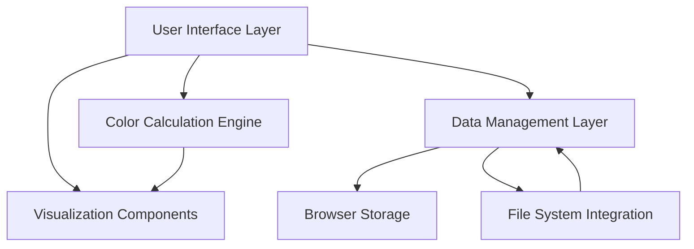
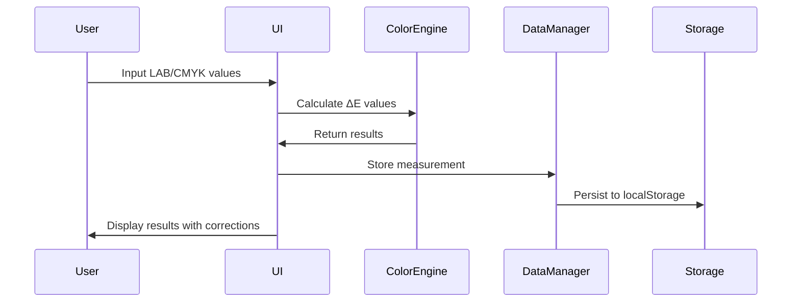

# Design Document

## Overview

The HD CMYK Batch Color Analysis system is a comprehensive web-based application for professional color management in print production workflows. The system provides real-time color comparison, batch analysis capabilities, and advanced color correction tools through a modern, responsive interface.

The application follows a modular architecture with distinct functional areas: color calculation engine, data management, visualization components, and integration utilities. All data processing occurs client-side for performance and privacy, with browser localStorage used for persistence.

## Architecture

### High-Level Architecture



### Component Structure

The application is organized into several key modules:

1. **Color Science Engine** - Core color calculations and conversions
2. **Grid Management System** - Batch data handling and visualization
3. **ICC Profile Handler** - Color profile parsing and application
4. **File Integration Layer** - CSV parsing and folder monitoring
5. **Library Management** - Brand color database operations
6. **Client Profile System** - Custom workflow management
7. **Reporting Engine** - Statistics and history tracking

### Data Flow



## Components and Interfaces

### Color Calculation Engine

**Purpose**: Handles all color space conversions and ΔE calculations

**Key Functions**:
- `dE76(target, press)` - CIE76 ΔE calculation
- `dE94(target, press)` - CIE94 ΔE calculation  
- `dE00(target, press)` - CIEDE2000 ΔE calculation
- `cmykogvToRgb(C,M,Y,K,O,G,V)` - Extended CMYK conversion
- `rgbToLab(r,g,b)` - RGB to LAB conversion
- `suggestCorrections(target, press, deltaE)` - Heuristic ink corrections

**Interface**:
```javascript
class ColorEngine {
  static calculateDeltaE(targetLab, pressLab, method = 'DE2000')
  static convertCMYKOGV(cmykogvValues)
  static generateCorrections(targetLab, pressLab, substrate)
  static applySubstrateProfile(values, substrateType)
}
```

### Grid Management System

**Purpose**: Manages batch color data with visualization capabilities

**Key Functions**:
- CSV parsing with multiple delimiter support
- Dynamic grid generation (4×6, 6×8, 10×10)
- Real-time ΔE calculation for all patches
- Interactive cell editing
- Statistical analysis (median, 95th percentile, max)

**Interface**:
```javascript
class GridManager {
  constructor(containerElement)
  loadFromCSV(file, pairingMode = 'alternating')
  generateGrid(rows, cols)
  updateCell(row, col, type, labValues)
  calculateStatistics()
  exportToCSV()
}
```

### Heatmap Visualization

**Purpose**: Provides visual representation of color accuracy across patches

**Key Features**:
- Canvas-based rendering with DPI scaling
- Real-time updates on data changes
- Color-coded intensity mapping
- Responsive layout adaptation

**Interface**:
```javascript
class HeatmapRenderer {
  constructor(canvasElement)
  render(gridData, tolerance)
  updateColors(newData)
  handleResize()
}
```

### ICC Profile Handler

**Purpose**: Manages color profile loading and application

**Supported Formats**:
- ICC v2 RGB matrix/TRC profiles
- DeviceLink CSV tables for CMYK→LAB conversion

**Key Functions**:
- Profile parsing and validation
- LAB to RGB conversion using ICC data
- Soft proofing with substrate simulation
- Fallback to approximate conversion

**Interface**:
```javascript
class ICCProfileHandler {
  loadProfile(iccFile)
  parseMatrixTRC(profileData)
  labToRgb(labValues)
  validateProfile(profileData)
}
```

### File Integration Layer

**Purpose**: Handles file operations and folder monitoring

**Capabilities**:
- CSV parsing with robust error handling
- File System Access API integration
- Drag-and-drop support
- Automatic folder monitoring for spectrophotometer integration

**Interface**:
```javascript
class FileIntegration {
  static parseCSV(file, options = {})
  static connectFolder()
  static monitorFolder(folderHandle)
  static handleDragDrop(dropZone)
}
```

### Color Correction Matrix (CCM)

**Purpose**: Implements systematic color correction using linear regression

**Algorithm**: 3×3 matrix computed via least squares regression
**Input**: Paired target/press LAB measurements
**Output**: Transformation matrix for color correction

**Interface**:
```javascript
class CCMProcessor {
  static computeMatrix(targetData, pressData)
  static applyCorrection(labValues, matrix)
  static validateInputData(targetData, pressData)
}
```

## Data Models

### Color Measurement
```javascript
{
  target: [L, a, b],      // Target LAB values
  press: [L, a, b],       // Measured LAB values
  cmykogv: [C,M,Y,K,O,G,V], // Ink percentages
  deltaE: {
    de76: number,
    de94: number,
    de2000: number
  },
  timestamp: Date,
  substrate: string,
  tolerance: number
}
```

### Grid Cell
```javascript
{
  t: [L, a, b],          // Target LAB
  p: [L, a, b],          // Press LAB
  de00: number,          // CIEDE2000 value
  position: {row, col}   // Grid coordinates
}
```

### Library Entry
```javascript
{
  code: string,          // Color code (e.g., "PANTONE 186 C")
  name: string,          // Display name
  L: number,             // LAB L* value
  a: number,             // LAB a* value  
  b: number,             // LAB b* value
  substrate: string,     // Substrate type
  notes: string          // Additional information
}
```

### Client Profile
```javascript
{
  name: string,
  tolerance: number,     // ΔE tolerance level
  notes: string,
  sop: [string],        // Standard Operating Procedures
  substrates: [string]   // Approved substrates
}
```

### Substrate Profile
```javascript
{
  name: string,
  toneA: number,        // a* paper tint
  toneB: number,        // b* paper tint
  gain: number,         // Dot gain factor
  weight: {             // Correction weights per channel
    C: number, M: number, Y: number, K: number,
    O: number, G: number, V: number
  }
}
```

## Error Handling

### Input Validation
- LAB values clamped to valid ranges (L*: 0-100, a*/b*: -128 to 128)
- CMYKOGV percentages limited to 0-100%
- File format validation for CSV and ICC files
- Matrix singularity checking for CCM computation

### Error Recovery
- Graceful fallback from ICC to approximate color conversion
- Alternative CSV parsing methods for malformed files
- Toast notifications for user feedback
- Automatic data sanitization on input

### Performance Safeguards
- Debounced input handling to prevent excessive calculations
- RequestAnimationFrame for smooth heatmap updates
- Chunked processing for large CSV files
- Memory management for file operations

## Testing Strategy

### Unit Testing
- Color calculation accuracy verification
- File parsing edge cases
- Matrix computation validation
- Input sanitization testing

### Integration Testing
- End-to-end workflow validation
- Cross-browser compatibility (Chrome, Firefox, Safari, Edge)
- File System Access API fallback testing
- ICC profile compatibility testing

### Performance Testing
- Large dataset handling (1000+ patches)
- Memory usage monitoring
- Rendering performance optimization
- File processing speed benchmarks

### User Acceptance Testing
- Workflow validation with print professionals
- Color accuracy verification against industry standards
- Usability testing for complex operations
- Mobile/tablet responsiveness validation

## Security Considerations

### Data Privacy
- All processing occurs client-side
- No data transmitted to external servers
- localStorage used for local persistence only
- File access limited to user-selected files

### Input Sanitization
- All numeric inputs validated and clamped
- File content validation before processing
- XSS prevention in dynamic content generation
- Safe handling of user-provided file names

## Performance Optimization

### Rendering Optimization
- Canvas-based heatmap with DPI scaling
- Debounced input handling
- RequestAnimationFrame for smooth updates
- Efficient DOM manipulation

### Memory Management
- Streaming CSV processing for large files
- Garbage collection friendly data structures
- Efficient color calculation algorithms
- Minimal DOM element creation

### Caching Strategy
- ICC profile parsing results cached
- Color conversion results memoized
- Statistical calculations cached until data changes
- Browser localStorage for persistent data

## Browser Compatibility

### Core Features (All Modern Browsers)
- Color calculations and conversions
- CSV file processing
- Grid visualization and heatmaps
- Library management
- Basic file operations

### Enhanced Features (Chrome/Edge)
- File System Access API for folder monitoring
- Advanced drag-and-drop capabilities
- Enhanced performance optimizations

### Fallback Strategies
- Drag-and-drop for browsers without File System Access API
- Approximate color conversion when ICC parsing fails
- Alternative CSV parsing methods
- Progressive enhancement approach