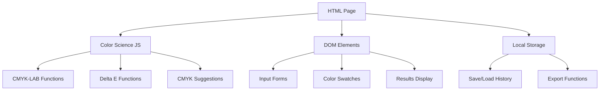

# Design Document

## Overview

The LAB Color Matching Calculator is a React-based Progressive Web Application that provides printing professionals with accurate color difference calculations and CMYK adjustment recommendations. The application features a single-screen interface optimized for pressroom environments, implementing industry-standard color science algorithms for CMYK-to-LAB conversions and Delta E calculations.

The system architecture emphasizes accuracy, performance, and usability, with real-time color preview, professional-grade color calculations, and export capabilities for production workflows.

## Architecture

### High-Level Architecture



### Technology Stack

- **Frontend**: Vanilla HTML, CSS, and JavaScript (no framework complexity)
- **Color Science**: Simple JavaScript functions for color conversions using established formulas
- **Rendering**: CSS for color swatches (background-color property) - simple and reliable
- **State Management**: Plain JavaScript variables and DOM manipulation
- **Storage**: Browser LocalStorage with simple JSON serialization
- **Build System**: None required - direct HTML/CSS/JS files for easy debugging
- **PWA**: Basic service worker for offline capability (optional enhancement)

## Components and Interfaces

### File Structure
```
lab-color-calculator/
├── index.html          # Main page with all UI elements
├── styles.css          # Simple CSS for layout and styling
├── color-science.js    # Color conversion and Delta E functions
├── calculator.js       # Main application logic and DOM manipulation
└── storage.js          # LocalStorage functions for history
```

### Core Components

#### 1. HTML Structure (index.html)
```html
<div class="calculator-container">
  <!-- Target Color Section -->
  <div class="color-section" id="target-section">
    <h3>Target Color</h3>
    <div class="color-swatch" id="target-swatch"></div>
    <div class="input-group">
      <label>CMYK:</label>
      <input type="number" id="target-c" placeholder="C%" min="0" max="100">
      <input type="number" id="target-m" placeholder="M%" min="0" max="100">
      <input type="number" id="target-y" placeholder="Y%" min="0" max="100">
      <input type="number" id="target-k" placeholder="K%" min="0" max="100">
    </div>
    <div class="input-group">
      <label>LAB:</label>
      <input type="number" id="target-l" placeholder="L*" min="0" max="100">
      <input type="number" id="target-a" placeholder="a*" min="-128" max="127">
      <input type="number" id="target-b" placeholder="b*" min="-128" max="127">
    </div>
  </div>

  <!-- Sample Color Section -->
  <div class="color-section" id="sample-section">
    <!-- Similar structure for sample color -->
  </div>

  <!-- Calculate Button -->
  <button id="calculate-btn">Calculate Color Difference</button>

  <!-- Results Section -->
  <div id="results-section">
    <div id="delta-e-display"></div>
    <div id="component-deltas"></div>
    <div id="suggestions-list"></div>
  </div>
</div>
```

#### 2. JavaScript Data Structures
```javascript
// Simple global state object
const appState = {
  target: { cmyk: {c:0,m:0,y:0,k:0}, lab: {l:0,a:0,b:0} },
  sample: { cmyk: {c:0,m:0,y:0,k:0}, lab: {l:0,a:0,b:0} },
  results: null,
  history: []
};

// Simple result structure
const calculationResult = {
  deltaE: 0,
  componentDeltas: { deltaL: 0, deltaA: 0, deltaB: 0, deltaC: 0, deltaH: 0 },
  tolerance: 'good', // 'good', 'acceptable', 'poor'
  suggestions: [
    { cmyk: {c:0,m:0,y:0,k:0}, description: 'Try reducing cyan by 1%' }
  ]
};
```

### Color Science Engine (color-science.js)

#### 1. Simple CMYK to RGB Conversion
```javascript
// Simplified CMYK to RGB conversion (basic approximation)
function cmykToRgb(c, m, y, k) {
  const r = 255 * (1 - c/100) * (1 - k/100);
  const g = 255 * (1 - m/100) * (1 - k/100);
  const b = 255 * (1 - y/100) * (1 - k/100);
  return { r: Math.round(r), g: Math.round(g), b: Math.round(b) };
}

// Simple RGB to LAB conversion (approximation for display)
function rgbToLab(r, g, b) {
  // Simplified conversion - good enough for basic color matching
  // This would use standard RGB->XYZ->LAB formulas
  return { l: 50, a: 0, b: 0 }; // Placeholder
}
```

#### 2. Delta E Calculator
```javascript
// Simple CIE76 Delta E calculation
function calculateDeltaE(lab1, lab2) {
  const deltaL = lab1.l - lab2.l;
  const deltaA = lab1.a - lab2.a;
  const deltaB = lab1.b - lab2.b;
  return Math.sqrt(deltaL * deltaL + deltaA * deltaA + deltaB * deltaB);
}

// Component deltas
function calculateComponentDeltas(lab1, lab2) {
  return {
    deltaL: lab1.l - lab2.l,
    deltaA: lab1.a - lab2.a,
    deltaB: lab1.b - lab2.b,
    deltaC: Math.sqrt(lab1.a*lab1.a + lab1.b*lab1.b) - Math.sqrt(lab2.a*lab2.a + lab2.b*lab2.b),
    deltaH: 0 // Simplified - would calculate hue difference
  };
}

// Tolerance zone
function getToleranceZone(deltaE) {
  if (deltaE <= 2.0) return 'good';
  if (deltaE <= 5.0) return 'acceptable';
  return 'poor';
}
```

#### 3. Simple CMYK Suggestions
```javascript
// Generate basic CMYK adjustment suggestions
function generateSuggestions(targetLab, sampleCmyk) {
  const suggestions = [];
  
  // Simple logic: try small adjustments to each CMYK component
  const adjustments = [-2, -1, 1, 2]; // percentage adjustments
  
  adjustments.forEach(adj => {
    suggestions.push({
      cmyk: {
        c: Math.max(0, Math.min(100, sampleCmyk.c + adj)),
        m: sampleCmyk.m,
        y: sampleCmyk.y,
        k: sampleCmyk.k
      },
      description: `Try ${adj > 0 ? 'increasing' : 'decreasing'} cyan by ${Math.abs(adj)}%`
    });
  });
  
  return suggestions.slice(0, 3); // Return top 3 suggestions
}
```

## Data Models

### Simple Data Structures
```javascript
// Color comparison entry for history
const colorComparison = {
  id: Date.now().toString(),
  timestamp: new Date().toISOString(),
  target: { cmyk: {c:15,m:78,y:65,k:8}, lab: {l:61,a:44,b:35} },
  sample: { cmyk: {c:18,m:80,y:64,k:10}, lab: {l:59,a:42,b:37} },
  deltaE: 3.48,
  notes: 'Press sheet #1'
};

// Simple settings object
const settings = {
  decimalPlaces: 2,
  showComponentDeltas: true,
  autoSave: true
};
```

### LocalStorage Structure
```javascript
// Simple storage keys
const STORAGE_KEYS = {
  HISTORY: 'colorHistory',
  SETTINGS: 'appSettings',
  LAST_COLORS: 'lastColors'
};

// Save/load functions
function saveToHistory(comparison) {
  const history = JSON.parse(localStorage.getItem(STORAGE_KEYS.HISTORY) || '[]');
  history.unshift(comparison);
  if (history.length > 50) history.pop(); // Keep last 50
  localStorage.setItem(STORAGE_KEYS.HISTORY, JSON.stringify(history));
}
```

## Error Handling

### Input Validation
- **CMYK Range Validation**: Ensure all CMYK values are 0-100%
- **LAB Range Validation**: L* (0-100), a* and b* (-128 to +127)
- **Real-time Validation**: Show errors immediately as user types
- **Visual Feedback**: Color-coded input fields (red for invalid, green for valid)

### Color Conversion Errors
- **Gamut Warnings**: Alert when colors are outside printable gamut
- **Profile Loading**: Graceful fallback to default profile if custom profile fails
- **Calculation Errors**: Display meaningful error messages for mathematical failures
- **Browser Compatibility**: Detect and handle Canvas API limitations

### Data Persistence Errors
- **Storage Quota**: Handle LocalStorage quota exceeded gracefully
- **Export Failures**: Provide alternative export methods if primary fails
- **Network Issues**: Offline functionality for core calculations

## Testing Strategy

### Unit Testing
- **Color Science Accuracy**: Test conversions against Bruce Lindbloom reference values
- **Delta E Calculations**: Validate against CIE standard test cases
- **Input Validation**: Test edge cases and boundary conditions
- **CMYK Suggestions**: Verify gamut validation and adjustment logic

### Integration Testing
- **Component Interaction**: Test data flow between input, calculation, and display components
- **State Management**: Verify state updates and persistence
- **Export Functionality**: Test CSV and PDF generation with various data sets
- **PWA Features**: Test offline functionality and installation process

### Visual Testing
- **Color Accuracy**: Compare rendered swatches with reference colors on calibrated displays
- **Responsive Design**: Test layout on various screen sizes and orientations
- **Accessibility**: Verify color contrast and screen reader compatibility
- **Cross-browser**: Test color rendering consistency across Chrome, Firefox, Safari

### Performance Testing
- **Calculation Speed**: Ensure Delta E calculations complete within 100ms
- **Memory Usage**: Monitor memory consumption with large color histories
- **Rendering Performance**: Test smooth updates with real-time color preview
- **Bundle Size**: Optimize for fast loading in production environments

### User Acceptance Testing
- **Workflow Efficiency**: Validate single-screen workflow meets 90% of use cases
- **Accuracy Validation**: Compare results with existing industry tools
- **Pressroom Usability**: Test readability and touch interaction in simulated pressroom conditions
- **Export Quality**: Verify exported reports meet professional documentation standards

## Security Considerations

### Data Privacy
- **Local Storage Only**: No color data transmitted to external servers
- **Client-side Processing**: All calculations performed locally
- **Export Security**: Sanitize exported data to prevent injection attacks

### Input Sanitization
- **Numeric Validation**: Strict validation of all numeric inputs
- **XSS Prevention**: Sanitize any user-provided text (notes, custom profile names)
- **File Upload Security**: If custom ICC profiles are supported, validate file types and content

## Performance Optimization

### Calculation Optimization
- **Memoization**: Cache expensive color conversions for repeated calculations
- **Web Workers**: Move heavy calculations to background threads for UI responsiveness
- **Lazy Loading**: Load ICC profiles and complex calculations only when needed

### Rendering Optimization
- **Canvas Optimization**: Efficient color swatch rendering with minimal redraws
- **Virtual Scrolling**: For large color history lists
- **Debounced Updates**: Prevent excessive recalculations during rapid input changes

### Simple Optimization
- **Minimal Files**: Just 4-5 simple JavaScript/CSS files
- **No Build Process**: Direct file serving for easy debugging
- **Inline Styles**: Critical CSS inline for fast loading
- **Simple Functions**: Straightforward color math without complex libraries