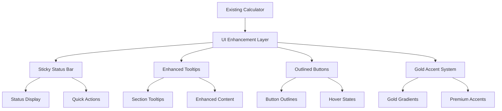

# Design Document

## Overview

The UI Enhancements feature builds upon the existing LAB Color Matching Calculator to improve user experience through enhanced visual elements, better tooltips, improved button styling, and premium gold accents. The enhancements will maintain the existing functionality while adding a sticky status bar, comprehensive tooltips, outlined button styling, and tasteful gold accents throughout the interface.

The current calculator includes comprehensive functionality with CMYK/LAB inputs, real-time color swatches, Delta E calculations, CMYK suggestions, G7 analysis, history management, export capabilities, and PWA features. The UI enhancements will build upon this solid foundation.

## Architecture

### Current System Analysis

The existing system uses:
- **Frontend**: Vanilla HTML, CSS, and JavaScript
- **Structure**: Single-page application with modular JavaScript files
- **Styling**: Comprehensive CSS with professional color scheme and responsive design
- **State Management**: Global application state with DOM manipulation
- **Color Science**: Dedicated color-science.js module with industry-standard calculations
- **Features**: Complete calculator with G7 integration, history, export, and PWA capabilities

### Enhancement Architecture



## Components and Interfaces

### 1. Enhanced Sticky Status Bar

#### Current State
- 4px gradient bar at top of calculator container (blue-green-yellow)
- Static positioning, no functionality
- CSS: `.calculator-container::before` with gradient background

#### Enhanced Design
```css
/* Enhanced sticky status bar */
.status-bar {
    position: fixed;
    top: 0;
    left: 0;
    right: 0;
    height: 60px;
    background: linear-gradient(90deg, #007bff 0%, #28a745 50%, #ffc107 100%);
    z-index: 1000;
    display: flex;
    align-items: center;
    justify-content: space-between;
    padding: 0 20px;
    box-shadow: 0 2px 8px rgba(0, 0, 0, 0.15);
    transform: translateY(-100%);
    transition: transform 0.3s ease;
}

.status-bar.visible {
    transform: translateY(0);
}
```

#### Functionality
- **Status Display**: Current Delta E value, calculation status
- **Quick Actions**: Reset button, calculate button, export shortcuts
- **Navigation**: Scroll to sections, toggle G7 analysis
- **Responsive**: Adapts to mobile screens with condensed layout

### 2. Enhanced Tooltip System

#### Current State
- Basic tooltip implementation using `[data-tooltip]` attribute
- Simple hover states with basic styling
- Limited content and positioning

#### Enhanced Design
```css
/* Enhanced tooltips with rich content */
.tooltip-enhanced {
    position: relative;
}

.tooltip-enhanced:hover::after {
    content: attr(data-tooltip);
    position: absolute;
    bottom: 100%;
    left: 50%;
    transform: translateX(-50%);
    background: linear-gradient(135deg, #1a252f 0%, #2c3e50 100%);
    color: white;
    padding: 12px 16px;
    border-radius: 8px;
    font-size: 0.9rem;
    white-space: pre-line;
    z-index: 1001;
    box-shadow: 0 6px 20px rgba(0, 0, 0, 0.25);
    margin-bottom: 8px;
    max-width: 300px;
    text-align: left;
    line-height: 1.4;
}

.tooltip-enhanced:hover::before {
    content: '';
    position: absolute;
    bottom: 100%;
    left: 50%;
    transform: translateX(-50%);
    border: 6px solid transparent;
    border-top-color: #1a252f;
    z-index: 1001;
    margin-bottom: 2px;
}
```

#### Content Enhancement
- **Target Section**: "Enter the desired color values for your target.\nSupports both CMYK ink percentages and LAB measurements.\nUse presets for common colors or input custom values."
- **Sample Section**: "Enter the measured color values from your sample.\nCompare against target to calculate color difference.\nReal-time swatch preview shows approximate color."
- **Delta Section**: "Displays calculated color difference results.\nΔE*ab shows total color difference.\nComponent deltas show individual L*, a*, b* differences."

### 3. Outlined Button System

#### Current State
- Gradient-filled buttons with hover effects
- Professional styling but not clearly outlined
- Good accessibility but could be more obvious as clickable elements

#### Enhanced Design
```css
/* Enhanced outlined button system */
.btn-outlined {
    background: transparent;
    border: 2px solid currentColor;
    color: #007bff;
    padding: 12px 24px;
    border-radius: 8px;
    font-weight: 600;
    transition: all 0.3s ease;
    position: relative;
    overflow: hidden;
}

.btn-outlined::before {
    content: '';
    position: absolute;
    top: 0;
    left: -100%;
    width: 100%;
    height: 100%;
    background: currentColor;
    transition: left 0.3s ease;
    z-index: -1;
}

.btn-outlined:hover {
    color: white;
    transform: translateY(-2px);
    box-shadow: 0 4px 12px rgba(0, 123, 255, 0.3);
}

.btn-outlined:hover::before {
    left: 0;
}

/* Button variants with gold accents */
.btn-outlined.gold {
    color: #d4af37;
    border-color: #d4af37;
}

.btn-outlined.gold:hover {
    box-shadow: 0 4px 12px rgba(212, 175, 55, 0.3);
}
```

### 4. Gold Accent System

#### Design Philosophy
- **Subtle Integration**: Gold accents enhance without overwhelming
- **Professional Appearance**: Maintains calculator's professional look
- **Accessibility**: Ensures sufficient contrast ratios
- **Hierarchy**: Uses gold to highlight important elements

#### Implementation Strategy
```css
/* Gold accent color palette */
:root {
    --gold-primary: #d4af37;
    --gold-light: #f4e4a6;
    --gold-dark: #b8941f;
    --gold-gradient: linear-gradient(135deg, #d4af37 0%, #f4e4a6 50%, #d4af37 100%);
}

/* Gold accent applications */
.gold-accent {
    background: var(--gold-gradient);
    -webkit-background-clip: text;
    -webkit-text-fill-color: transparent;
    background-clip: text;
}

.gold-border {
    border-color: var(--gold-primary);
}

.gold-shadow {
    box-shadow: 0 4px 12px rgba(212, 175, 55, 0.2);
}
```

#### Application Areas
- **Headers**: Section titles with gold gradient text
- **Important Values**: Delta E results with gold highlighting
- **Premium Features**: G7 analysis indicators
- **Interactive Elements**: Focus states and active buttons
- **Status Indicators**: Success states and achievements

## Data Models

### Enhanced UI State
```javascript
const uiEnhancementState = {
    statusBar: {
        visible: false,
        content: {
            deltaE: null,
            status: 'ready', // 'ready', 'calculating', 'complete', 'error'
            quickActions: ['reset', 'calculate', 'export']
        }
    },
    tooltips: {
        enhanced: true,
        content: {
            target: "Enter the desired color values...",
            sample: "Enter the measured color values...",
            delta: "Displays calculated color difference..."
        }
    },
    goldAccents: {
        enabled: true,
        intensity: 'medium', // 'subtle', 'medium', 'prominent'
        areas: ['headers', 'results', 'premium-features']
    },
    buttonStyle: {
        outlined: true,
        hoverEffects: true,
        goldVariants: ['primary-actions', 'premium-features']
    }
};
```

### Scroll State Management
```javascript
const scrollState = {
    lastScrollY: 0,
    scrollDirection: 'down',
    statusBarThreshold: 100,
    isStatusBarVisible: false
};
```

## Error Handling

### UI Enhancement Error Handling
- **Graceful Degradation**: If enhancements fail, original UI remains functional
- **Feature Detection**: Check for CSS support before applying advanced styles
- **Fallback Styling**: Provide fallback styles for older browsers
- **Performance Monitoring**: Track enhancement impact on performance

### Accessibility Considerations
- **Contrast Ratios**: Ensure gold accents meet WCAG AA standards
- **Focus Indicators**: Enhanced focus states for keyboard navigation
- **Screen Reader Support**: Proper ARIA labels for enhanced elements
- **Motion Preferences**: Respect prefers-reduced-motion settings

## Testing Strategy

### Visual Testing
- **Cross-browser Compatibility**: Test enhancements across major browsers
- **Responsive Design**: Verify enhancements work on all screen sizes
- **Color Accuracy**: Ensure gold accents display consistently
- **Performance Impact**: Monitor rendering performance with enhancements

### Functionality Testing
- **Sticky Bar Behavior**: Test scroll-triggered visibility
- **Tooltip Interactions**: Verify hover states and positioning
- **Button Interactions**: Test outlined button hover and click states
- **Integration Testing**: Ensure enhancements don't break existing features

### Accessibility Testing
- **Keyboard Navigation**: Test all enhanced elements with keyboard
- **Screen Reader Testing**: Verify compatibility with assistive technologies
- **Color Contrast**: Validate all color combinations meet standards
- **Motion Sensitivity**: Test with reduced motion preferences

## Implementation Phases

### Phase 1: Sticky Status Bar
1. Create sticky bar HTML structure
2. Implement scroll detection and visibility logic
3. Add status display functionality
4. Integrate quick actions
5. Test responsive behavior

### Phase 2: Enhanced Tooltips
1. Upgrade existing tooltip system
2. Create comprehensive tooltip content
3. Implement enhanced styling
4. Add positioning logic for edge cases
5. Test across different screen sizes

### Phase 3: Outlined Button System
1. Create outlined button CSS classes
2. Apply to existing buttons systematically
3. Implement hover and focus states
4. Add gold accent variants
5. Test accessibility compliance

### Phase 4: Gold Accent Integration
1. Define gold color palette and variables
2. Apply to headers and important elements
3. Create gold gradient text effects
4. Add gold accent interactive states
5. Ensure accessibility compliance

### Phase 5: Integration and Polish
1. Integrate all enhancements cohesively
2. Optimize performance and animations
3. Conduct comprehensive testing
4. Fine-tune visual hierarchy
5. Document enhancement system

## Performance Considerations

### CSS Optimization
- **Efficient Selectors**: Use specific selectors to avoid unnecessary reflows
- **Hardware Acceleration**: Use transform and opacity for animations
- **Critical CSS**: Inline critical enhancement styles
- **Lazy Loading**: Load non-critical enhancements after initial render

### JavaScript Optimization
- **Event Delegation**: Use efficient event handling for scroll detection
- **Debouncing**: Debounce scroll events for status bar visibility
- **Memory Management**: Clean up event listeners and observers
- **Progressive Enhancement**: Load enhancements after core functionality

## Security Considerations

### Content Security Policy
- **Inline Styles**: Minimize inline styles for CSP compliance
- **External Resources**: Ensure all enhancement resources are from trusted sources
- **XSS Prevention**: Sanitize any dynamic content in tooltips
- **Resource Integrity**: Use SRI for any external enhancement resources